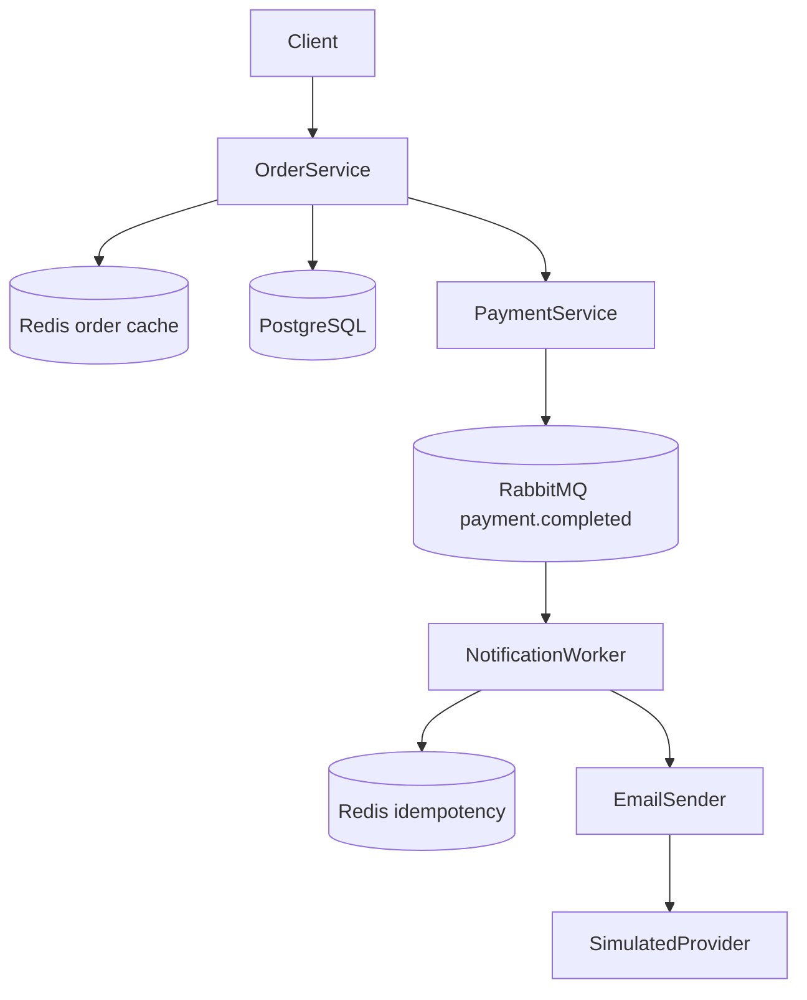

# AP2 Assignment 3 – Event-Driven Architecture
## How to run
1. Clone repository
```bash
git clone <your-repo>
cd app2-grpc
```

2. Start all services

```bash
docker-compose up --build
```

⸻

Services

* Order Service (HTTP + gRPC)
* Payment Service (gRPC)
* Notification Service (RabbitMQ Consumer)
* PostgreSQL (Database)
* RabbitMQ (Message Broker)

⸻

Ports

* 8080 → Order HTTP API
* 50052 → Order gRPC
* 50051 → Payment gRPC
* 5672 → RabbitMQ
* 15672 → RabbitMQ UI
* 5442 → PostgreSQL (host)

⸻

How to test

1. Send request

POST http://localhost:8081/orders
{
  "order_id": "1",
  "amount": 99.99,
  "customer_email": "user@example.com"
}

⸻

2. Expected response

{
  "order_id": "1",
  "paid": true,
  "message": "payment processed successfully"
}

⸻

3. Check notification logs

```bash
docker-compose logs -f notification-service
```

Expected:

[Notification] Sent email to user@example.com for Order #1. Amount: $99.99

⸻

Event Flow

Order Service → Payment Service → RabbitMQ → Notification Service

⸻

Reliability

* Manual ACK (no auto-ack)
* Durable queue (payment.completed)
* Persistent messages
* Idempotency using event_id

⸻

Summary

* Order Service creates orders
* Payment Service processes payments and publishes events
* RabbitMQ delivers events
* Notification Service consumes events and logs notifications
* System is asynchronous and decoupled

## Assignment 4: Performance Optimization & External Integrations

### Redis cache-aside in Order Service

The Order Service now uses Redis for `GET /orders/:id`.

Flow:
1. Check Redis key `order:{id}`.
2. If the key exists, return the cached order.
3. If the key does not exist, read the order from PostgreSQL.
4. Save the order to Redis with TTL from `ORDER_CACHE_TTL`, default `5m`.
5. When order status changes, delete `order:{id}` from Redis immediately.

This prevents stale statuses after payment updates.

### Notification worker

The Notification Service consumes `payment.completed` messages from RabbitMQ. Sending notifications is done in the worker, not in the API request path.

### Provider adapter

Notification sending uses the `EmailSender` interface. `PROVIDER_MODE=SIMULATED` starts a simulated provider that waits 1.5 seconds and randomly fails. This tests retry logic without needing a real email provider.

### Retry and exponential backoff

If the provider fails, the worker retries. With `MAX_RETRIES=3`, the backoff is:

- 2 seconds
- 4 seconds
- 8 seconds

### Redis idempotency

Before sending, the worker checks Redis key `notification:payment:{event_id}`. If the key exists, the message is skipped. After successful sending, the key is saved as `sent` for 24 hours. This prevents duplicate emails during retry or redelivery.

### Architecture diagram



### How to run

```bash
docker compose up --build
```

Test cache endpoint:

```bash
curl http://localhost:8081/orders/1
```
